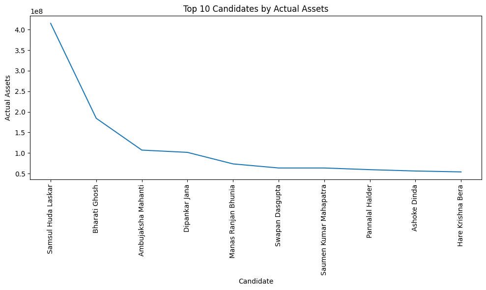
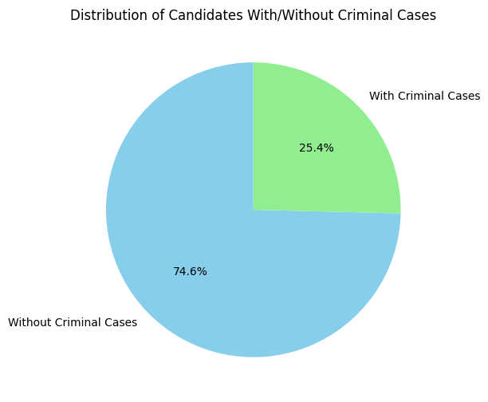
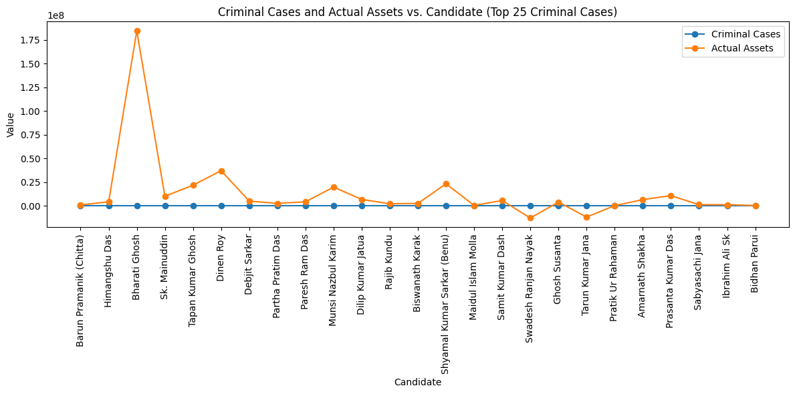
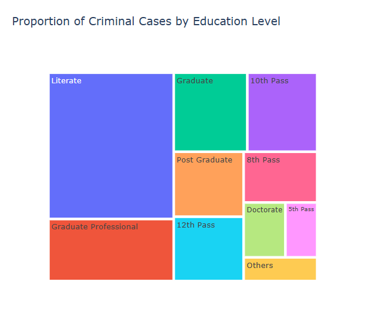

# 🗳️ West Bengal Candidate-Level Election Data Analysis

This project explores and visualizes candidate-level election data from **West Bengal** using Python and Pandas. It focuses on analyzing asset declarations and criminal backgrounds to identify patterns across the political landscape.

---

## 🚀 Launch the Notebook in Google Colab

[](https://colab.research.google.com/drive/1Tepm-Oj6OsMS6nXGTNNJLBntc9ij9M_L?usp=sharing)

---

## 🧠 Project Summary

- **Analyzed** West Bengal's election dataset to uncover insights on candidate wealth and criminal cases.
- **Engineered** the `actual_assets` feature for true net worth calculation by subtracting liabilities.
- **Visualized** data with compelling bar, pie, and line charts to illustrate distribution patterns.
- **Sorted and filtered** candidates based on wealth and criminal record for targeted insights.
- Demonstrated **proficiency in data cleaning, transformation, and visual storytelling** using real-world electoral data.

---

## 📊 Key Insights

- Some candidates with criminal records possess high-value assets.
- The **top 10 richest candidates** show major gaps in declared assets.
- Overlaps observed between criminal background and asset accumulation.
- Pie charts depict proportions of candidates with and without criminal records.
- Bar and line charts clearly illustrate comparative criminal case counts and asset growth.

---

## 📁 Dataset

The dataset includes:
- Candidate Name
- Party Affiliation
- Criminal Cases
- Total Assets
- Liabilities
- Constituency

Source: [ADR India](https://adrindia.org/) (via CSV)

---

## 🛠️ Technologies Used

| Tool        | Purpose                          |
|-------------|----------------------------------|
| `Python`    | Core analysis scripting          |
| `Pandas`    | Data preprocessing and wrangling |
| `Matplotlib`| Visualizations                   |
| `Seaborn`   | Statistical plots (if used)      |
| `Google Colab` | Cloud-based execution         |

---

## 📂 Project Structure

```
/west-bengal-election-analysis/
├── west_bengal.csv               # Dataset (candidate-level info)
├── westbengal.ipynb      # Main analysis notebook (on Colab)
├── assets/
│   └── criminal_distribution_pie.png.png  
└── README.md                     # This file
```

---

## 📈 Visualizations

### 📊 Top 10 Candidates by Actual Assets


### 🥧 Distribution of Candidates With/Without Criminal Cases


### 📈 Criminal Cases vs. Candidate Assets (Line Chart)


### 📈 Treemap of Criminal Cases by Education Level



---

## 🔍 Feature Engineering

- `actual_assets` = total_assets − liabilities
- Candidates sorted by `actual_assets` for ranking and comparison
- Data cleaned for nulls and inconsistencies in numeric fields

---

## 👤 Author

Crafted with diligence by **Barna Das**  
🔗 [GitHub](https://github.com/barna-d)

---

## 📝 License

This project is released under the **MIT License**.
